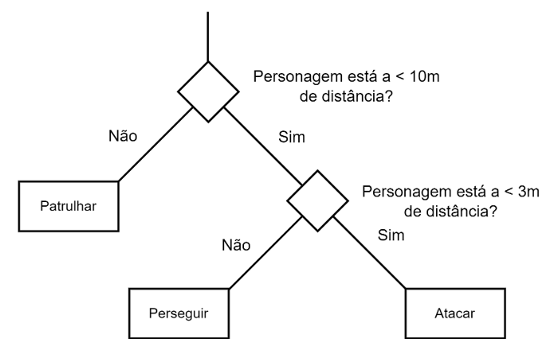

# Exemplo simplificado de Árvore de Decisão para ilustrar o conceito de Heurística em Games
Este projeto é aplicado no Bacharelado em Jogos Digitais, disciplina de Agentes Inteligentes, com o tópico Heurística em Games.
São aplicados os pseudo-códigos de Ian Millington, da obra AI for Games, Third Edition, página 305 à 307.

