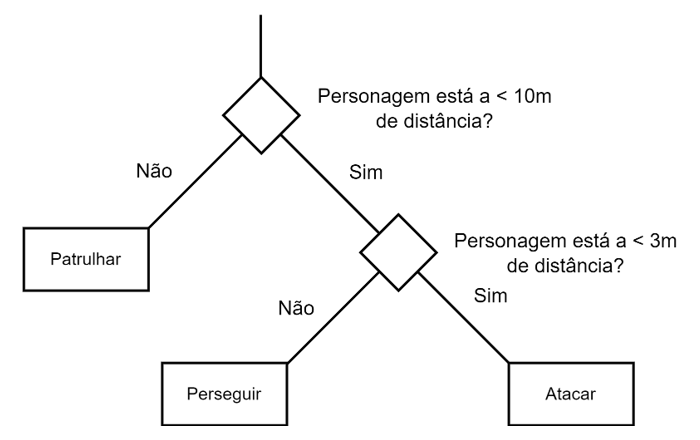

# Exemplo simplificado de Árvore de Decisão para ilustrar o conceito de Heurística em Games
Este projeto é utilizado no Bacharelado em Jogos Digitais, disciplina de Agentes Inteligentes, com o tópico Heurística em Games.

São trabalhados os pseudo-códigos de Ian Millington, da obra AI for Games, Third Edition, página 305 à 307, Boca Raton: CRC-Press, 2016.

A árvore de decisão da imagem abaixo é aplicada em um exemplo simples, para demonstrar a tomada da decisão com base em uma condição simples.

Notar que para visualizar a execução do código, rode o game na Unity e, através da janela **Scene**, aproxime ou afaste o player (objeto **Player**) da cápsula vermelha.
Observe a alteração dos estados na janela **Console**.
